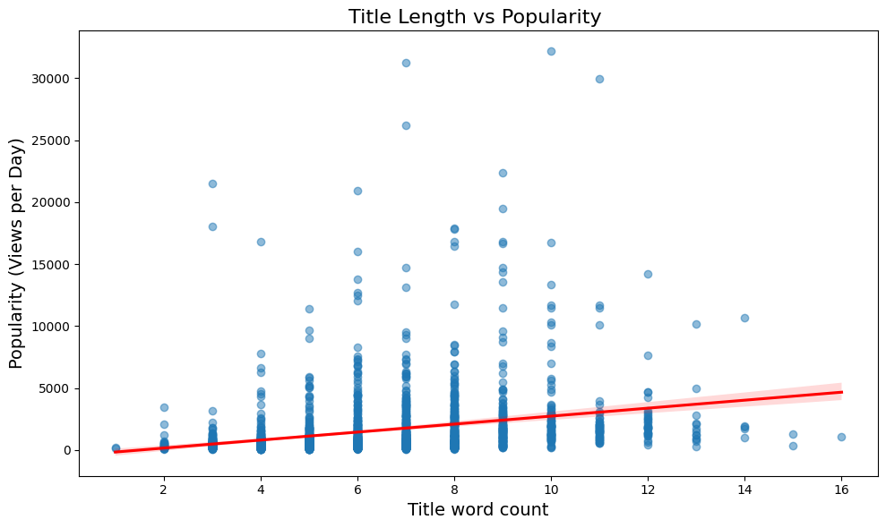

# TED Talk Popularity Analysis

[](https://opensource.org/licenses/MIT)


This project analyzes factors influencing the popularity of TED Talks using statistical methods and machine learning. The goal is to uncover actionable insights for content creators to enhance audience engagement.

---

## 📌 Project Overview
- **Objective**: Identify key features (e.g., title style, speech pace, topic) that drive TED Talk popularity.
- **Dataset**: [TED Talks Dataset](https://www.kaggle.com/datasets/rounakbanik/ted-talks)with metadata, ratings, and transcripts (up to September 2017).
- **Popularity Metric**: Normalized views per day (`views / days_since_release`).
- **Tools**: Python, scikit-learn, pandas, TextBlob, textstat.

---

## 🔍 Key Research Questions
1. Do specific title words or description styles boost popularity?
2. Are certain topics inherently more popular?
3. How do speech pace, talk length, and language complexity affect popularity?
4. Can we predict popularity using pre-talk data?

---

## 🛠️ Analysis Workflow
1. **Data Preparation**:  
   - Merged datasets, cleaned outliers (IQR method), imputed missing values.
2. **Feature Engineering**:  
   - Engineered features: `views_per_day`, `feedback_score`, sentiment polarity, readability scores, tag analysis.
3. **Exploratory Analysis**:  
   - Title length, starting words, tag correlations, description length, transcript complexity.
4. **Model Training**:  
   - Tested regression models (Ridge, Lasso, Random Forest, Gradient Boosting) to predict popularity.

---

## 📊 Results & Insights
### Key Findings
- **Titles**: Medium-length titles (9–11 words) and those starting with "3" or phrased as questions performed better.
- **Topics**: Weak positive correlation for tags like "society" and "identity".
- **Speech Pace**: Slower-paced talks (<150–160 words/minute) were more popular.
- **Talk Length**: 10–14 minute talks aligned with higher popularity.
- **Predictive Models**: Best model (Random Forest) achieved validation R² of 0.555. Prediction performance was limited, highlighting the complexity of popularity dynamics.

### Result Visualizations
| Figure | Description |
|--------|-------------|
|  | **Figure 1**: Titles of medium length (9–11 words) showed higher average popularity. |
|  | **Figure 2**: Tags like "society" weakly correlated with popularity. |
|  | **Figure 3**: Slower speech pace (<150 WPM) linked to higher popularity. |

---

## 📂 How to Use This Repository
1. **Clone the repo**:
   ```bash
   git clone https://github.com/Arsalaan-Ahmad/TED-Talk-Analysis.git# TED Talk Popularity Analysis

[](https://opensource.org/licenses/MIT)


This project analyzes factors influencing the popularity of TED Talks using statistical methods and machine learning. The goal is to uncover actionable insights for content creators to enhance audience engagement.

---

## 📌 Project Overview
- **Objective**: Identify key features (e.g., title style, speech pace, topic) that drive TED Talk popularity.
- **Dataset**: [TED Talks Dataset](https://www.kaggle.com/datasets/rounakbanik/ted-talks) with metadata, ratings, and transcripts (up to September 2017).
- **Popularity Metric**: Normalized views per day (`views / days_since_release`).
- **Tools**: Python, scikit-learn, pandas, TextBlob, textstat.

---

## 🔍 Key Research Questions
1. Do specific title words or description styles boost popularity?
2. Are certain topics inherently more popular?
3. How do speech pace, talk length, and language complexity affect popularity?
4. Can we predict popularity using pre-talk data?

---

## 🛠️ Analysis Workflow
1. **Data Preparation**:  
   - Merged datasets, cleaned outliers (IQR method), imputed missing values.
2. **Feature Engineering**:  
   - Engineered features: `views_per_day`, `feedback_score`, sentiment polarity, readability scores, tag analysis.
3. **Exploratory Analysis**:  
   - Title length, starting words, tag correlations, description length, transcript complexity.
4. **Model Training**:  
   - Tested regression models (Ridge, Lasso, Random Forest, Gradient Boosting) to predict popularity.

---

## 📊 Results & Insights
### Key Findings
- **Titles**: Medium-length titles (9–11 words) and those starting with "3" or phrased as questions performed better.
- **Topics**: Weak positive correlation for tags like "society" and "identity".
- **Speech Pace**: Slower-paced talks (<150–160 words/minute) were more popular.
- **Talk Length**: 10–14 minute talks aligned with higher popularity.
- **Predictive Models**: Best model (Random Forest) achieved validation R² of 0.555. Prediction performance was limited, highlighting the complexity of popularity dynamics.

### Result Visualizations
| Figure | Description |
|--------|-------------|
|  | **Figure 1**: Titles of medium length (9–11 words) showed higher average popularity. |
|  | **Figure 2**: Tags like "society" weakly correlated with popularity. |
|  | **Figure 3**: Slower speech pace (<150 WPM) linked to higher popularity. |

---

## 📂 How to Use This Repository
1. **Clone the repo**:
   ```bash
   git clone https://github.com/Arsalaan-Ahmad/TED-Talk-Analysis.git
